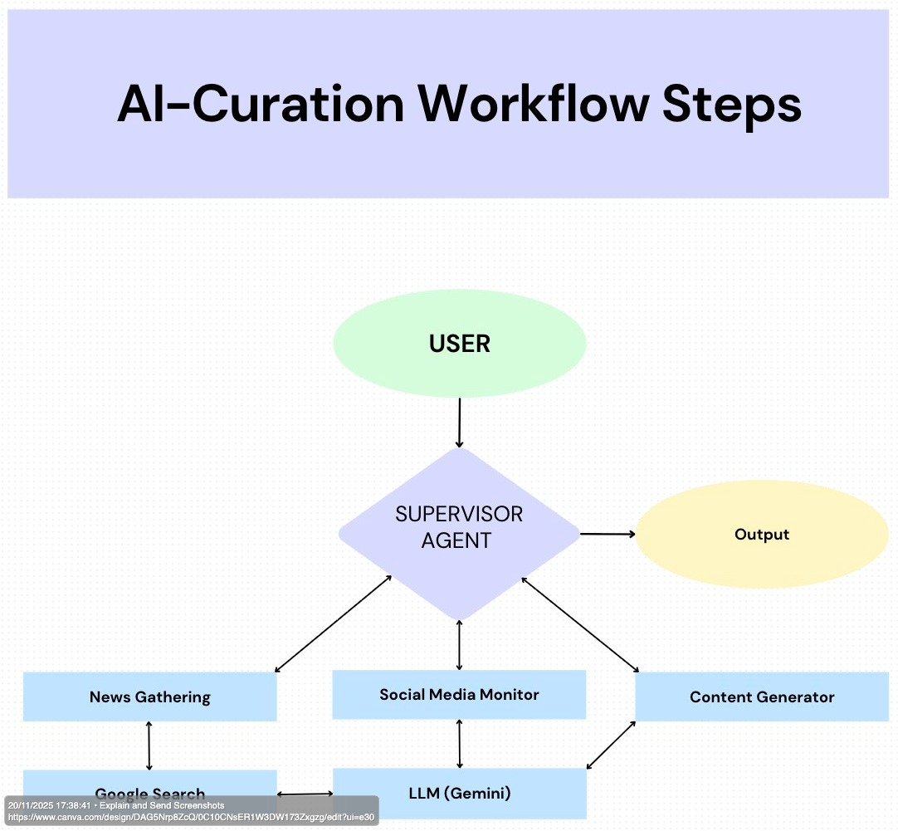

# AI-Curation System 🤖

<div align="center">


**Intelligent Content Curation and Publication Platform**

Automate your content workflow with AI-powered agents that gather, analyze, and create publication-ready content.

[](https://www.python.org/downloads/)
[](LICENSE)
[](https://github.com/google/adk)

[Features](#-features) • [Installation](#-installation) • [Project Structure](#-project-structure) • [Workflow Steps](#-workflow-steps) • 

</div>

---

## 📖 Project Overview

**AI-Curation** is an intelligent, autonomous content curation and publication system that leverages multiple specialized AI agents to:

- **Discover** the latest news articles and industry events
- **Monitor** social media platforms for trending content
- **Generate** publication-ready blog posts, summaries, and social updates
- **Maintain** consistent brand voice and style across all content

The system uses a multi-agent architecture orchestrated by a Supervisor Agent that manages workflow execution, implements retry logic, and ensures reliable content delivery.

### 🎯 Use Cases

- **Tech Advocacy Organizations**: Automate content creation for technology advocacy campaigns
- **Marketing Teams**: Generate consistent brand content from industry news
- **Content Creators**: Streamline research and content production workflow
- **Media Publishers**: Automate news curation and summary generation
- **Developer Relations**: Create technical content from product updates

---

## ✨ Features

### 🤖 Multi-Agent Architecture

- **News Gathering Agent**: Discovers and extracts information from news sources and event calendars
- **Social Media Monitoring Agent**: Tracks and analyzes posts from configured social media accounts
- **Content Generation Agent**: Creates summaries, blog posts, and social media content
- **Supervisor Agent**: Orchestrates the entire workflow with intelligent error handling

### 🔄 Intelligent Workflow Management

- **Automatic Retry Logic**: Up to 3 retry attempts per step with exponential backoff
- **Error Recovery**: Graceful failure handling with detailed error logging
- **State Management**: Complete workflow state tracking and reporting
- **Parallel Execution**: Support for concurrent agent operations (configurable)

### ✍️ Content Generation

- **News Summaries**: Concise, engaging summaries of news articles
- **Blog Posts**: Comprehensive 500-2500 word articles with SEO optimization
- **Social Media Content**: Platform-optimized posts (Twitter, LinkedIn, Facebook)
- **Brand Consistency**: Maintains consistent voice, tone, and style

### 📊 Reporting & Analytics

- **Workflow Reports**: Detailed execution reports with timing and success metrics
- **Content Quality Validation**: Automated quality checks and recommendations
- **Trending Topics Analysis**: Identification of trending themes and hashtags
- **Engagement Metrics**: Social media engagement tracking and analysis

### 🔧 Customization

- **Configurable Brand Voice**: Customize tone, style, and perspective
- **Flexible Content Length**: Adjustable content length (short/medium/long)
- **Custom Keywords**: Define custom search keywords and topics
- **Platform Selection**: Choose which social media platforms to monitor

---


### Agent Responsibilities

| Agent | Responsibilities | Tools |
|-------|-----------------|-------|
| **News Gathering** | • Search for news articles<br>• Discover events<br>• Extract metadata | Google Search |
| **Social Media Monitor** | • Track social accounts<br>• Extract posts<br>• Analyze trends | Google Search |
| **Content Generator** | • Summarize articles<br>• Write blog posts<br>• Create social content | LLM, Google Search |
| **Supervisor** | • Orchestrate workflow<br>• Handle retries<br>• Manage state | All agents |

---

## 🚀 Installation

### Prerequisites

- **Python 3.9 or higher**
- **pip** (Python package installer)
- **Google API Key** (for Google ADK)

### Step-by-Step Installation

#### 1. Clone the Repository

```bash
git clone https://github.com/yang-danny/AI-Curation.git
cd AI-Curation
```
#### 2. Create Virtual Environment (Recommended)
```bash
# Create virtual environment
python3 -m venv venv

# Activate virtual environment
# On macOS/Linux:
source venv/bin/activate

# On Windows:
venv\Scripts\activate
```

#### 3. Install Dependencies

```bash 
pip install -r requirements.txt
```
#### 4. Set Up API Keys
Edit .env and add your API keys:
```bash 
GOOGLE_API_KEY=your_google_api_key_here
WORKER_MODEL=gemini-2.5-flash
```
#### 5. Start the Application

```bash 
python3 main.py 
```

## 📁 Project Structure
```bash 
AI-Curation/
│
├── agents/                          # AI Agent modules
│   ├── __init__.py
│   ├── news_gatherer.py            # News gathering agent
│   ├── social_media_watch.py       # Social media monitoring agent
│   ├── content_generator.py        # Content generation agent
│   └── supervisor.py               # Supervisor orchestrator agent
│
├── utils/                           # Utility modules
│   ├── __init__.py
│   ├── social_media_utils.py       # Social media helper functions
│   ├── formatting_utils.py         # Content formatting utilities
│   ├── content_utils.py            # Content processing utilities
│   └── workflow_utils.py           # Workflow management utilities
│
├── templates/                       # Content templates
│   ├── __init__.py
│   ├── brand_voice.py              # Brand voice guidelines
│   ├── blog_template.py            # Blog post templates
│   └── summary_template.py         # Summary templates
│
├── docs/                            # Documentation
│   ├── images/                      # Documentation images
│   │   ├── architecture.png
│   │   └── workflow.png
│   └── API.md                       # API documentation
│
├── output/                          # Generated outputs
│   ├── content/                     # Generated content files
│   ├── logs/                        # Workflow logs and reports
│   └── [timestamped results]
│
├── tests/                           # Test files (optional)
│   ├── test_agents.py
│   └── test_workflow.py
│
├── main.py                          # Main entry point
├── config.py                        # Configuration management
├── agent_utils.py                   # Agent utility functions
├── validation_checkers.py           # Content validation agents
├── requirements.txt                 # Python dependencies
├── .env.example                     # Example environment file
├── .gitignore                       # Git ignore rules
├── LICENSE                          # MIT License
└── README.md                        # This file
```
## 🔄 Workflow Steps


### The Supervisor Agent executes the following steps:

#### 1️⃣ News Gathering
- **Searches for latest tech news** 
- **Discovers upcoming events** 
- **Validates and filters results** 
- **Retry: Up to 3 attempts on failure** 

#### 2️⃣ Social Media Monitoring
- **Monitors configured social accounts** 
- **Extracts recent posts** 
- **Analyzes engagement and trends** 
- **Retry: Up to 3 attempts on failure** 

#### 3️⃣ Content Generation
- **Creates news summaries** 
- **Writes comprehensive blog posts** 
- **Generates social media content** 
- **Maintains brand voice consistency** 
- **Retry: Up to 3 attempts on failure** 

#### 4️⃣ Final Output
- **Compiles all results** 
- **Saves publication-ready content** 
- **Generates workflow report** 
- **Creates execution logs** 

## 📜 License
MIT License

Copyright (c) 2024 AI-Curation Contributors

Permission is hereby granted, free of charge, to any person obtaining a copy
of this software and associated documentation files (the "Software"), to deal
in the Software without restriction, including without limitation the rights
to use, copy, modify, merge, publish, distribute, sublicense, and/or sell
copies of the Software, and to permit persons to whom the Software is
furnished to do so, subject to the following conditions:
